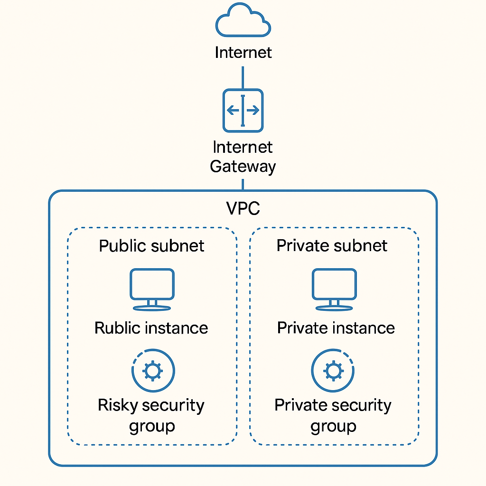
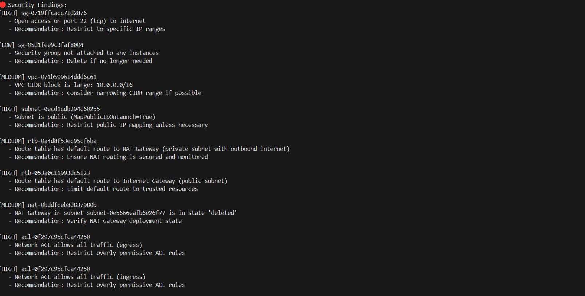
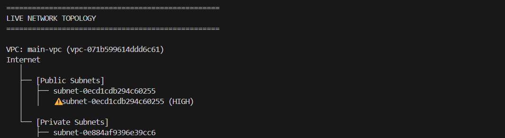
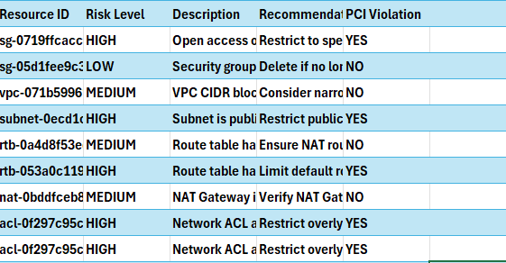

Cloud Security Analyzer
=======================

Overview
--------

The Cloud Security Analyzer is a Python-based tool designed to scan and analyze AWS cloud resources to identify potential network security risks. It uses boto3 to interact with AWS APIs and Terraform to provision the necessary infrastructure. The tool generates detailed security findings, outputting them as CSV reports for easy review and remediation.

This project helps cloud engineers and security teams improve their cloud security posture by automating the detection of risky configurations such as open ports, overly permissive security groups, and misconfigured network resources.

---

Architecture Diagram
--------------------

Below are diagrams illustrating the AWS infrastructure provisioned with Terraform and the scanning process performed by the analyzer.

---
Scan Results
-------------------

Below are screenshots of the scan results produced by the analyzer.

---

AWS CSV Report Sample
---------------------

Below is a snippet from a CSV report generated by the analyzer:

Setup Instructions
------------------

1. Clone the repository

   git clone https://github.com/YourUsername/cloud-security-analyzer.git
   cd cloud-security-analyzer

2. Create and activate a Python virtual environment

   python3 -m venv venv
   source venv/bin/activate   # Linux/macOS
   # OR
   venv\Scripts\activate      # Windows

3. Install dependencies

   pip install -r requirements.txt

4. Configure AWS credentials

   aws configure

5. Deploy Terraform infrastructure

   cd terraform
   terraform init
   terraform apply

6. Run the analyzer

   cd ..
   python aws_analyzer.py

---

License
-------

This project is licensed under the MIT License - see the LICENSE file for details.

---

Contact
-------

Created by Ryan - feel free to reach out!

---

Notes on Adding Screenshots/Diagrams:
- Place all image files inside a folder named 'docs' or 'images' in your repo.
- Reference the images in your GitHub README.md using markdown like:

  #!#

- For README.txt, mention the file names clearly as above, and optionally add instructions to view them alongside the text.

---